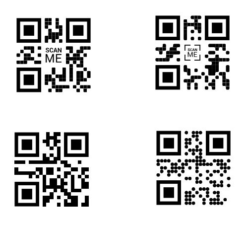

# QR / Barcode Scanner

Browser-based scanner for QR codes and barcodes with multi-code detection,
tap-to-select overlay, and a live list of detected codes.

Runs directly in the browser on iOS and Android — no app, no build step,
no framework. Plain HTML + JavaScript.

## Features

- Detects multiple codes in a single camera frame simultaneously
- Each detected code is outlined in the live camera view
- The decoded content is shown below each outline
- A single code is selected automatically
- When multiple codes are visible, the user picks one by tapping its rectangle
- Persistent panel showing the currently detected codes and the active selection
- Tap target around each rectangle is enlarged, so "almost-hits" still count
- Supports QR, Aztec, Data Matrix, PDF417, EAN, UPC, Code 128/39/93, Codabar, ITF

## Supported code types

```
QR Code, Aztec, Data Matrix, PDF417,
Code 128, Code 39, Code 93, Codabar,
EAN-13, EAN-8, UPC-A, UPC-E, ITF
```

## Browser support

| Browser                              | Engine                  | Status         |
|--------------------------------------|-------------------------|----------------|
| Chrome / Edge (Android)              | native BarcodeDetector  | fully supported |
| Safari                               | ZXing via CDN fallback  | fully supported |
| Firefox                              | ZXing via CDN fallback  | fully supported |
| Desktop Chrome (Windows/macOS/Linux) | native BarcodeDetector  | fully supported |

## Requirements

- A web server with **HTTPS** (required for `getUserMedia` — browsers block
  camera access on insecure origins). Local testing also works via
  `http://localhost`.
- A modern browser (see the table above)

## Installation

Clone the repository into a web server directory, for example under XAMPP:

```bash
git clone https://github.com/Sytroxitz/qrcode-scan.git
```

Copy the files into a folder served by your web server and open it via HTTPS:

```
https://localhost/qrcode-scan/
```

From a phone on the same network, use the host PC's IP:

```
https://<pc-ip>/qrcode-scan/
```

On the first visit you will be asked to accept the self-signed certificate
XAMPP ships with — accept it once and you're good.

## Project structure

```
├── index.html       Markup, styles, bootstrap script for the ZXing fallback
├── scanner.js       CodeScanner class — engine, detection, overlay, UI
├── test-codes.png   Test image with four QR codes for multi-detection
└── README.md
```

Three source files, no build tools, no npm.

## Test codes

The repo includes a test image with four QR codes in different styles. Use it
to try out multi-detection and tap-to-select right away.



Point the camera at the image — either on a screen or printed out. All four
codes should be outlined in orange at the same time, each with the decoded
value shown below. Tapping a rectangle selects that code; tapping "Reset"
clears the current selection.

Need your own test codes? Generate them with
[qr-code-generator.com](https://www.qr-code-generator.com/) or any QR
library of your choice.

## Integration

The scanner dispatches a custom event whenever a code is selected:

```js
window.addEventListener('qr:selected', event =>
{
  console.log('Code:', event.detail.value);
  // forward to your backend, fill a form, navigate, ...
});
```

The event fires both when a single code is auto-selected and when the user
manually taps a rectangle. Repeated selections of the same value are
deduplicated.

## Configuration

All thresholds live as `static` constants at the top of the class:

```js
class CodeScanner
{
  static PERSIST_MS         = 2000;   // how long a code stays in the overlay
  static DETECT_INTERVAL_MS = 120;    // detection rate
  static MAX_DETECT_DIM     = 1024;   // frame is downscaled to this before decoding
  static HIT_PAD_PX         = 24;     // click hitbox padding around each rectangle
  static HIT_NEAR_LIMIT_PX  = 80;     // "almost-tap" still selects nearest code
  ...
}
```

Common tweaks:

- Codes flicker on your device? Raise `PERSIST_MS` (e.g. 3000)
- Battery drains too fast? Raise `DETECT_INTERVAL_MS` (e.g. 200)
- Weak hardware? Lower `MAX_DETECT_DIM` (e.g. 768)

## How it works

1. `getUserMedia` streams the camera feed into the `<video>` element
2. Each frame is copied to an off-screen canvas, downscaled to max 1024 px
3. `BarcodeDetector.detect()` (native) or ZXing decodes the canvas
4. Detected codes go into a tracker keyed by `rawValue` with a timestamp
5. Codes stay in the tracker for 2 s even when the detector briefly loses
   them — this prevents the overlay from flickering
6. A render loop redraws all currently tracked codes via `requestAnimationFrame`
7. Clicks on the overlay are matched to a code using point-in-polygon
8. A single code is auto-selected; multiple codes require a manual tap

## License

MIT
